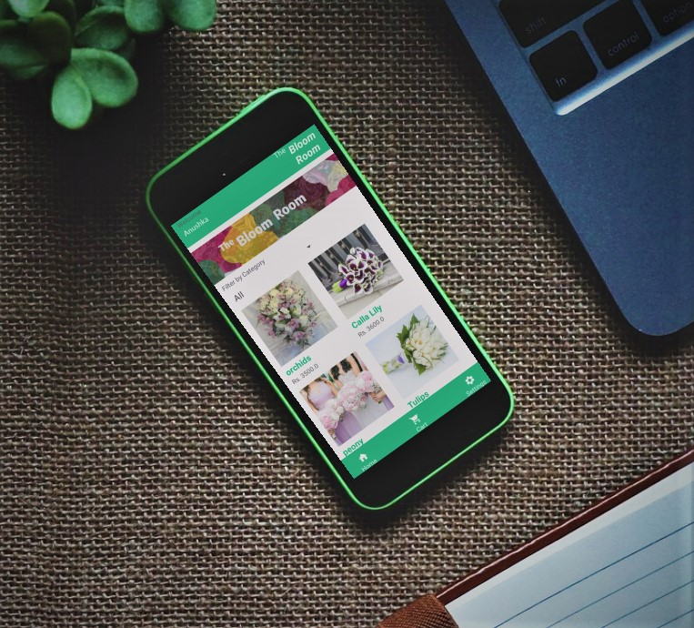
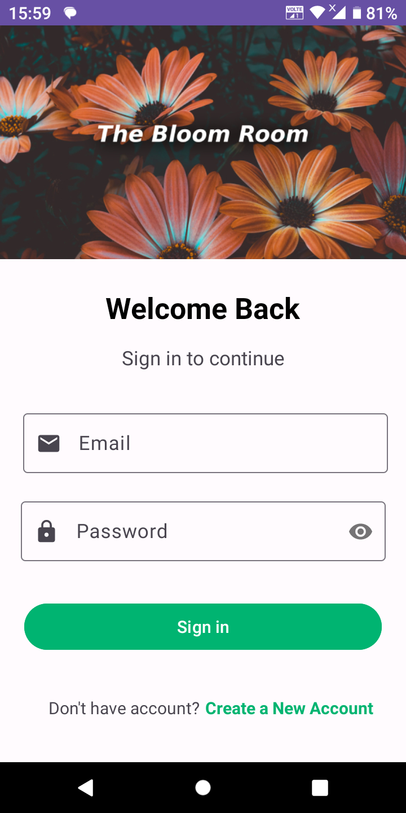
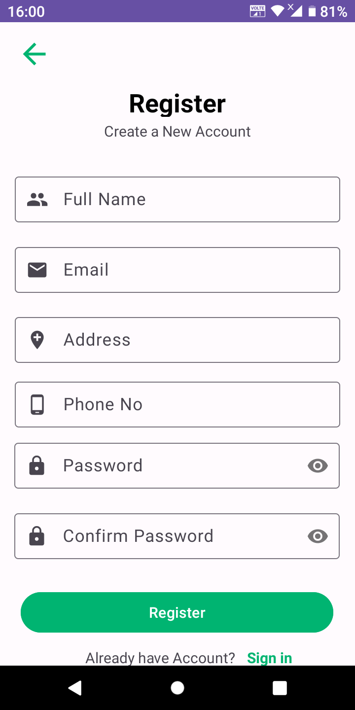
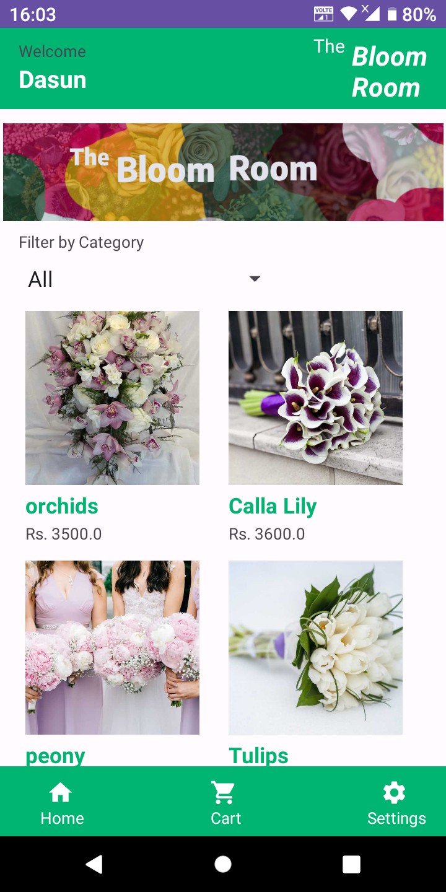
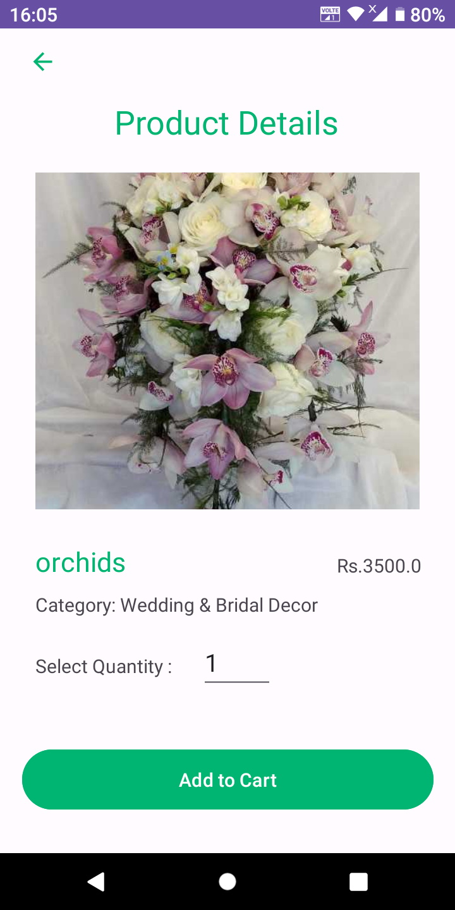
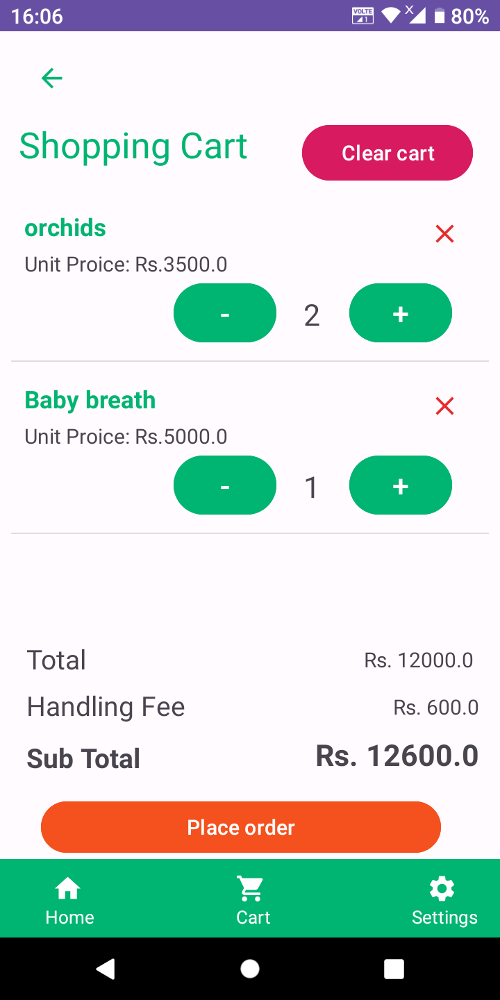
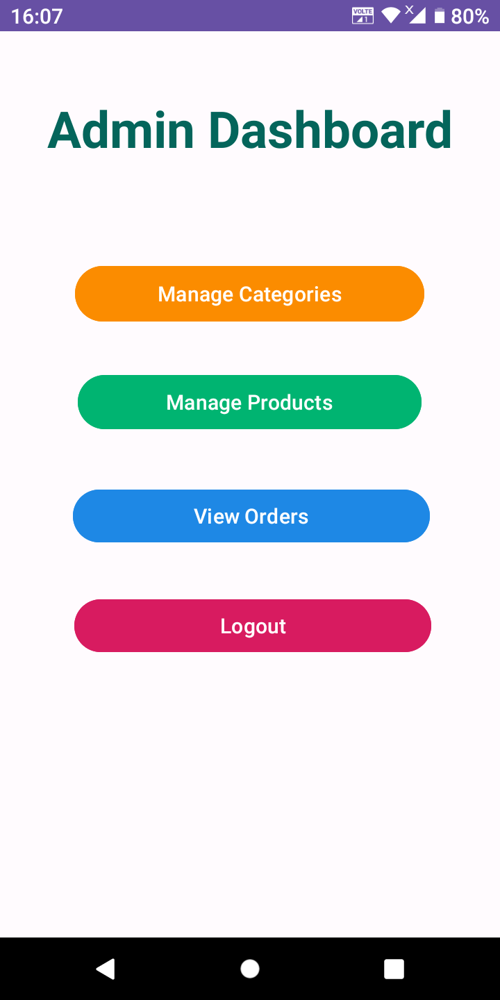
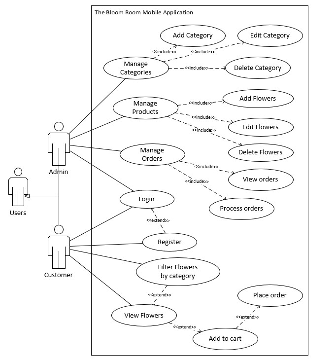

# The Bloom Room Android App

 <!-- You can insert an image of your app here -->

## Description
This Android app is designed for The Bloom Room, a small boutique in Colombo, Sri Lanka. It allows users to explore and purchase flowers conveniently.

## Features
- Login and Signup with validation
- Clean and intuitive UI design
- Browse available flowers with category filtering
- View flower details and add them to the cart
- Customize the cart and place orders
- Admin panel for managing categories, flowers, and viewing orders

## Screenshots
Here are some snapshots of the app:

<!-- Add more screenshots if needed -->

## Project Structure
- **Language**: Java
- **Database**: SQLite
- **Android Studio Version**: Android Studio Giraffe | 2022.3.1 Patch 4
- **Minimum SDK**: 24
- **Target SDK**: 34

## Installation
1. Clone the repository
2. Open the project in Android Studio
3. Build and run the app on an emulator or a physical device

## How to Use
Download the APK from Build app folder

## Diagrams

- Use case diagram

- Class diagram

## Contributors
- [Anushka Lakshan](https://www.linkedin.com/in/anushka-lakshan-79590925b/) - Designer and Developer

